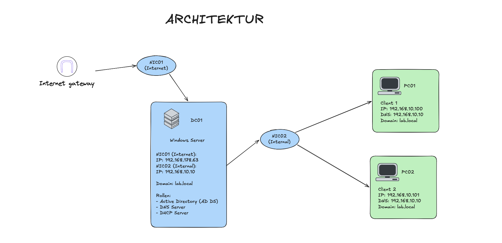

<h1 align="center">🖥️ Windows Enterprise Lab</h1>

  Simulation einer vollständigen Windows-Unternehmensinfrastruktur · Lernprojekt & Portfolio

  
  
  
  

<strong>⚠️ Hinweis:</strong> 
Dieses Projekt befindet sich derzeit in der Entwicklungsphase. Aus diesem Grund kann die Dokumentation stellenweise unvollständig sein oder noch ergänzt werden.

## Projektübersicht

In diesem Projekt wird eine realitätsnahe Windows-Unternehmensumgebung aufgebaut und simuliert. Ziel ist es, ein funktionierendes Firmennetzwerk mit zentraler Verwaltung zu erstellen und die grundlegenden Abläufe moderner IT-Infrastrukturen praktisch zu verstehen.

Der Fokus liegt auf der Einrichtung eines Servers auf Basis von Windows Server 2022, der zentrale Dienste wie Active Directory, DNS und DHCP bereitstellt. Ergänzend dazu werden Client-Systeme mit Windows 11 Pro eingebunden, die in die Domäne integriert und zentral verwaltet werden.

Zusätzlich werden typische Aufgaben aus der Praxis umgesetzt, wie Benutzerverwaltung, Rechtevergabe sowie die Analyse und Behebung von Netzwerk- und Systemproblemen. Das Lab wird kontinuierlich erweitert, um weitere Technologien und realistische Szenarien zu integrieren und so praxisnahe IT-Kenntnisse aufzubauen.

## 🗺️ Architektur-Übersicht

<table>
  <tr>
    <td width="60%" valign="top">
      <h2>📘 Systembeschreibung</h2>
      

        Die Architektur zeigt eine zentral verwaltete Unternehmensumgebung mit einem Domain Controller (DC01), 
        der zentrale Dienste wie Active Directory, DNS und DHCP bereitstellt.
      

      

        Die Clients (PC01, PC02) sind über ein internes Netzwerk verbunden und Teil der Domäne. 
        Sie beziehen ihre Netzwerkkonfiguration automatisch vom DHCP-Server und nutzen den DNS-Server 
        zur Namensauflösung.
      

      

        Zusätzlich verfügt der Server über eine zweite Netzwerkschnittstelle, die den Zugriff auf das Internet ermöglicht.
      

    </td>
    <td width="40%" valign="top">
      <h2>⚙️ Systemdaten</h2>
      

        <strong>Domain Controller:</strong> DC01 
        <strong>Clients:</strong> PC01, PC02 
        <strong>Domain:</strong> lab.local 
        <strong>Netzwerk:</strong> 192.168.10.0/24
      

    </td>
  </tr>
</table>

### 🛠️ Tech-Stack

| Technologie         | Verwendung                       |
| ------------------- | -------------------------------- |
| Windows Server 2022 | Domain Controller, Server-Rollen |
| Windows 11 Pro      | Client-Systeme (PC01, PC02)      |
| VirtualBox          | Virtualisierungsplattform        |
| Active Directory DS | Zentrale Benutzerverwaltung      |
| DNS / DHCP          | Netzwerkdienste                  |

## 🗂️ Dokumentation

| Dokument                 | Inhalt                                                        |
| ------------------------ | ------------------------------------------------------------- |
| `01-infrastruktur.md`    | Systemübersicht, Hardware, Netzwerkkonfiguration, Domain Join |
| `02-network.md`          | Netzwerkarchitektur, DNS, DHCP, IP-Schema                     |
| `03-active-directory.md` | OU-Struktur, Benutzer, Gruppen, Verifikation                  |
| `04-GPO.md`              | Gruppenrichtlinien, Passwort-Policy, Client Restrictions      |
