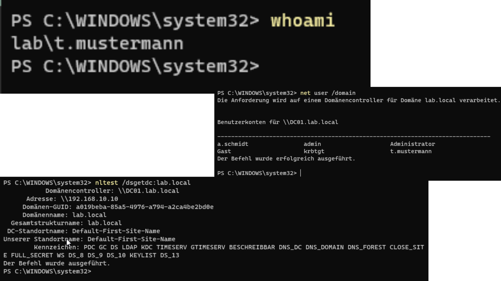

<h1 align="center">🏗️ INFRASTRUKTUR</h1>

  Detaillierte Beschreibung der virtuellen Laborumgebung zur Simulation einer Unternehmens-IT.

<strong>Hinweis:</strong> 
Diese Umgebung wird kontinuierlich erweitert, um komplexere Szenarien (z. B. Exchange, Monitoring oder Security-Hardening) abzubilden.

## 🧠 Zielsetzung & Architektur

Das Hauptziel dieses Projekts ist die realitätsnahe Nachbildung einer Windows-basierten Unternehmensstruktur. Der Fokus liegt auf der zentralen Identitätsverwaltung und der Durchsetzung von Sicherheitsrichtlinien.

**Kern-Features:**

- **Zentrale Verwaltung:** Implementierung eines Active Directory Domain Controllers (AD DS).
- **Netzwerksegmentierung:** Logische Trennung der Systeme in einem dedizierten Subnetz.
- **Automatisierung:** Dynamische IP-Vergabe und Namensauflösung via DHCP und DNS.
- **Sicherheitsfokus:** Isolierte Testumgebung zur gefahrlosen Simulation von GPOs und Software-Deployments.

## 🔍 System-Überblick

Die gesamte Umgebung ist virtualisiert und nutzt ein hybrides Netzwerkmodell, um Sicherheit mit Funktionalität zu verbinden.

- **Virtualisierungs-Plattform:** Oracle VirtualBox
- **Netzwerk-Modus:** Internes Netzwerk (`labnet`) für Client-Server-Kommunikation.
- **Internetzugriff:** Realisiert über ein zweites Interface (NAT) am Domain Controller (Routing-Funktion).
- **Adressraum:** `192.168.10.0/24`

### 💻 System-Matrix

| Hostname | Rolle                             | Betriebssystem      | IP-Adresse      | Ressourcen       |
| :------- | :-------------------------------- | :------------------ | :-------------- | :--------------- |
| **DC01** | Domain Controller (AD, DNS, DHCP) | Windows Server 2022 | `192.168.10.10` | 4 vCPU, 6 GB RAM |
| **PC01** | Domänenclient                     | Windows 11 Pro      | DHCP            | 2 vCPU, 4 GB RAM |
| **PC02** | Domänenclient                     | Windows 11 Pro      | DHCP            | 2 vCPU, 4 GB RAM |

## 🌐 Netzwerkkonfiguration & Dienste

### 📡 Segmentierung

Um die Umgebung abzusichern, befinden sich alle Clients in einem **isolierten Segment**. Der Domain Controller fungiert als einzige Brücke (optional), was eine präzise Kontrolle des Datenflusses ermöglicht.

| Parameter            | Konfiguration          |
| :------------------- | :--------------------- |
| **Netzwerkname**     | `labnet`               |
| **Subnetzmaske**     | `255.255.255.0`        |
| **Standard-Gateway** | `192.168.10.10` (DC01) |
| **Primärer DNS**     | `192.168.10.10` (DC01) |

### ⚙️ Dienste-Konfiguration

1. **Active Directory:** Domäne `lab.local` dient als zentrale Authentifizierungsinstanz.
2. **DNS:** Zuständig für die interne Namensauflösung; Forwarding an externe DNS für Internetanfragen.
3. **DHCP:** Automatische Zuweisung von IPs im Bereich `.100` bis `.200` für Clients.

## 🔗 Domänen-Integration (Domain Join)

Die Integration der Clients erfolgt klassisch über den Domain Join in die `lab.local`. Dies ermöglicht:

- **Single Sign-On (SSO):** Anmeldung mit zentralen Benutzerkonten an jedem Client.

- **GPO-Management:** Verteilung von Sicherheitsrichtlinien (z.B. USB-Sperren, Desktop-Hintergründe).

- **Zentrale Updates:** Vorbereitung für WSUS oder ähnliche Dienste.

### ✅ Verifikation (Infrastruktur)

| Test                       | Befehl                      | ErwartetesErgebnis                       |
| -------------------------- | --------------------------- | ---------------------------------------- |
| Netzwerkverbindung         | `ping DC01`                 | Antwort vom Domain Controller            |
| Client-Kommunikation       | `ping PC02`                 | Clients können miteinander kommunizieren |
| DNS-Auflösung              | `nslookup DC01`             | Hostname wird korrekt in IP aufgelöst    |
| Domain Controller gefunden | `nltest /dsgetdc:lab.local` | DC01 wird erkannt                        |

  

## ✅ Validierung der Umgebung

Um die Integrität der Infrastruktur sicherzustellen, wurden folgende Tests erfolgreich durchgeführt:

- [x] **Konnektivität:** `ping` zwischen allen Hosts erfolgreich (ICMP-Freigabe vorausgesetzt).
- [x] **Namensauflösung:** DNS-Abfragen lösen interne FQDNs sowie SRV-Records korrekt auf.
- [x] **Dynamische IP-Konfiguration:** Clients beziehen automatisch gültige IP-Adressen über DHCP inklusive DNS-Optionen.
- [x] **Authentifizierung:** Domänen-Login mit Testbenutzern auf verschiedenen Clients erfolgreich.

<strong>📊 FAZIT:</strong> 

Diese Infrastruktur bildet eine stabile und skalierbare Grundlage und zeigt praxisnah die Funktionsweise von Active Directory, Netzwerkdiensten und der Client-Server-Interaktion.

