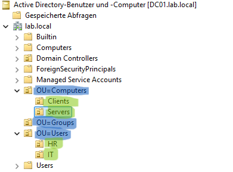

<h1 align="center">Active Directory</h1>

<p align="center">
  Aufbau und Konfiguration der Active Directory Domain Services (AD DS) innerhalb der simulierten Windows-Unternehmensumgebung.<br>
  Ziel: Eine skalierbare, realitätsnahe Infrastruktur als Grundlage für GPO-Richtlinien und zentrale IT-Verwaltung.
</p>

<hr style="border: none; height: 5px; background: linear-gradient(to right, transparent, #ffff, transparent); margin: 30px 0;">

## 🧠 Architektur-Ziel

<table>
  <tr>
    <td width="50%" valign="top">
      <strong>Zentrale Verwaltung</strong><br>
      Benutzer, Computer und Gruppen werden ausschließlich über den Domain Controller (DC01) verwaltet keine dezentrale Verwaltung lokaler Benutzerkonten.
    </td>
    <td width="50%" valign="top">
      <strong>Grundlage für GPOs</strong><br>
      Die OU-Struktur ist so aufgebaut, dass Gruppenrichtlinien granular und gezielt angewendet werden können – z.B. unterschiedliche Policies für IT und HR.
    </td>
  </tr>
  <tr>
    <td width="50%" valign="top">
      <strong>Skalierbarkeit</strong><br>
      Neue Abteilungen, Benutzer oder Server können jederzeit in die bestehende Struktur integriert werden, ohne die Basis zu verändern.
    </td>
    <td width="50%" valign="top">
      <strong>Realitätsnähe</strong><br>
      Die Struktur orientiert sich an gängigen Enterprise-Designs: OU-Trennung nach Funktion, nicht nach Standort – optimiert für kleine bis mittelgroße Unternehmen.
    </td>
  </tr>
</table>

<hr style="border: none; height: 2px; background: linear-gradient(to right, transparent, #ffffff66, transparent); margin: 30px 0;">

## 🧱 Organisationseinheiten (OU)

Die OU-Struktur wurde bewusst so aufgebaut, dass Benutzer, Computer und Gruppen logisch voneinander getrennt sind.
Dieses Design orientiert sich an realen Unternehmensumgebungen und ermöglicht eine saubere, skalierbare Verwaltung.

```
lab.local
├── OU=Users
│ ├── IT
│ └── HR
├── OU=Computers
│ ├── Clients
│ └── Servers
└── OU=Groups
```

<table>
  <tr>
    <td width="60%" valign="top">
      <p>
        Die Struktur folgt dem Prinzip der klaren Trennung von Verantwortungsbereichen.
        Benutzer werden nach Abteilungen organisiert, Computer nach Rollen (Clients und Server)
        und Berechtigungen zentral über Gruppen gesteuert.
      </p>
      <p>
        Dadurch können administrative Aufgaben effizient umgesetzt und Richtlinien gezielt
        angewendet werden, beispielsweise unterschiedliche Gruppenrichtlinien für Clients
        und Server.
      </p>
      <p>
        Dieses Setup bildet eine solide Grundlage für typische Unternehmensanforderungen
        wie Benutzerverwaltung, Zugriffskontrolle und zukünftige Erweiterungen.
      </p>
    </td>
    <td width="40%" valign="top">
      <p>
        
      </p>
    </td>
  </tr>
</table>

### 👤 Benutzerverwaltung

<table>
  <tr>
    <td width="60%" valign="top">
      <p>
        Benutzer werden zentral im Active Directory verwaltet und den jeweiligen Abteilungen zugeordnet.
      </p>
      <table>
        <tr>
          <th>Benutzername</th>
          <th>Anzeigename</th>
          <th>OU</th>
          <th>Gruppe</th>
        </tr>
        <tr>
          <td>t.mustermann</td>
          <td>Thomas Mustermann</td>
          <td>Users/IT</td>
          <td>GG_IT</td>
        </tr>
        <tr>
          <td>a.schmidt</td>
          <td>Anna Schmidt</td>
          <td>Users/HR</td>
          <td>GG_HR</td>
        </tr>
      </table>
    </td>
    <td width="40%" valign="top">
<p align="center">
  
</p>
    </td>
  </tr>
</table>

### 👥 Gruppenverwaltung

<table>
  <tr>
    <td width="60%" valign="top">
      <p>
        Gruppen dienen der zentralen Steuerung von Berechtigungen.
      </p>
      <table>
        <tr>
          <th>Gruppenname</th>
          <th>Typ</th>
          <th>Zweck</th>
        </tr>
        <tr>
          <td>GG_IT</td>
          <td>Sicherheitsgruppe</td>
          <td>Zugriff für IT</td>
        </tr>
        <tr>
          <td>GG_HR</td>
          <td>Sicherheitsgruppe</td>
          <td>Zugriff für HR</td>
        </tr>
      </table>
    </td>
    <td width="40%" valign="top">
<p align="center">
  
</p>
    </td>
  </tr>
</table>

<hr style="border: none; height: 2px; background: linear-gradient(to right, transparent, #ffff, transparent); margin: 30px 0;">

## ✅ Validierung (Active Directory)

Zur Sicherstellung der korrekten Funktion der Active Directory Umgebung im praktischen Einsatz wurden folgende Tests durchgeführt:

| Test                 | Durchführung                    | Erwartetes Ergebnis                       |
| -------------------- | ------------------------------- | ----------------------------------------- |
| Benutzeranmeldung    | Login auf PC01 mit Domänenkonto | Anmeldung erfolgreich                     |
| Gruppenzugehörigkeit | AD-Konsole prüfen               | Benutzer in richtiger Gruppe (z.B. GG_IT) |
| OU-Zuordnung         | AD Users & Computers            | Benutzer/Computer in korrekter OU         |
| Zentrale Verwaltung  | Benutzer im AD erstellen        | Neuer Benutzer sofort auf Client nutzbar  |


<p align="center">
  
</p>

<hr style="border: none; height: 2px; background: linear-gradient(to right, transparent, #ffff, transparent); margin: 30px 0;">

## 🏁 Fazit

Die Active Directory Umgebung wurde erfolgreich aufgebaut und strukturiert umgesetzt.

Alle zentralen Komponenten wie:

- Organisationseinheiten (OU)
- Benutzer- und Gruppenverwaltung
- Computerintegration
- Domain Join
- Verifikation

funktionieren fehlerfrei und bilden eine stabile Grundlage für eine zentrale IT-Verwaltung.

Das System ist skalierbar und kann problemlos um weitere Benutzer, Abteilungen oder Richtlinien (GPOs) erweitert werden.
